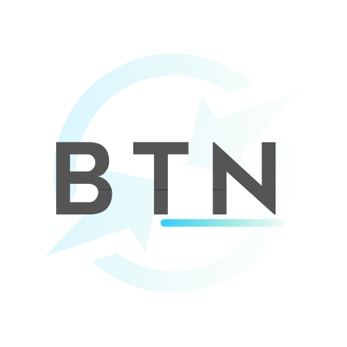

<a href="https://btn.lf112.net">
    
</a>

<div align="left">

# BT-Panel NEXT

**_<a href="https://btn.lf112.net">BTN.LF112.NET</a>_** / 🎨 新一代 BTPanel 前端重构 「Front-end reconstruction of new generation BT-Panel based on plug-in.」

</div>


> ```bash
> $ echo 'High cohesion & Low coupling.'
> $ # 快速开始！
> $ git clone https://github.com/btnext/BTN.git && cd BTN
> $ yarn && yarn run start --port=1024
>
> ________________   _____   ______________  _________
> ___  __ )__  __/   ___  | / /__  ____/_  |/ /__  __/
> __  __  |_  /      __   |/ /__  __/  __    /__  /
> _  /_/ /_  /       _  /|  / _  /___  _    | _  /
> /_____/ /_/        /_/ |_/  /_____/  /_/|_| /_/
> ```

## 介绍

- `BTNEXT` 是基于 `react` 开发的 `BT-Panel Plugin` 旨在提供更好的面板体验。

  - 完整的面板界面、操作
  - 扁平风格
  - 按需加载
  - ......

- 技术栈
  - 前端框架 [React](https://reactjs.org/)
  - 构建工具 [Vite](https://vitejs.dev/)

> `BTN` ≈ `BTCO 3.0`，`BTN` 实则是在继 `BTCO` 发布后而重新构建的，更加全面的响应式面板插件的下一个版本。

### 截图


## 参与贡献

任何人都可以为 BTN 的做出贡献，可参考下面的指南：

### 向本项目提交代码

1. Fork 本项目并下载到你的本地
2. 提交代码
3. 从你的分支发起 PR 到 dev 分支

> 你的代码将会在审计后于下一个正式版本发布。

## 开源许可

    Copyright (C) 2022  LF112 (futiwolf)

    This program is free software: you can redistribute it and/or modify
    it under the terms of the GNU Affero General Public License as
    published by the Free Software Foundation, either version 3 of the
    License, or (at your option) any later version.

    This program is distributed in the hope that it will be useful,
    but WITHOUT ANY WARRANTY; without even the implied warranty of
    MERCHANTABILITY or FITNESS FOR A PARTICULAR PURPOSE.  See the
    GNU Affero General Public License for more details.

    You should have received a copy of the GNU Affero General Public License
    along with this program.  If not, see <https://www.gnu.org/licenses/>.
